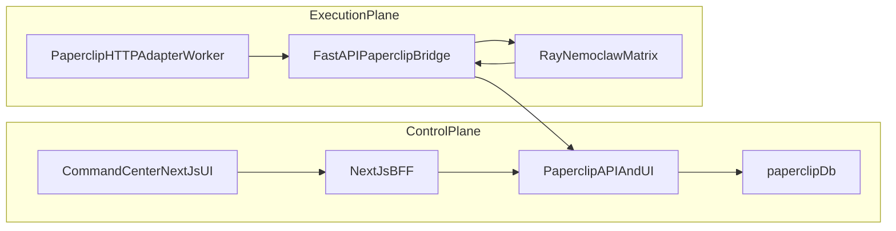

# Paperclip Sovereign Deployment

Paperclip is deployed as an internal control-plane service on the sovereign k3s cluster.
It is not the execution engine. It orchestrates work and delegates execution to the
existing Fortress agent matrix through a dedicated FastAPI bridge.

## Architecture



## Deployment Principles

- No public ingress is created in k3s.
- Service exposure remains internal-only through a `ClusterIP` service.
- PostgreSQL traffic goes directly to the host-native sovereign PostgreSQL 16 instance.
- Raw credentials never belong in Git. Apply the secret manifest out-of-band after injecting rotated values.
- `PAPERCLIP_HOME` is persisted so local storage, uploaded artifacts, and the secrets layer survive pod restarts.

## Apply Order

```sh
kubectl apply -f namespace.yaml
kubectl apply -f secret.example.yaml
kubectl apply -f configmap.yaml
kubectl apply -f pvc.yaml
kubectl apply -f service.yaml
kubectl apply -f networkpolicy.yaml
kubectl apply -f glass-proxy-configmap.yaml
kubectl apply -f glass-proxy-deployment.yaml
kubectl apply -f glass-proxy-service.yaml
kubectl apply -f ingress.yaml
kubectl apply -f deployment.yaml
```

Or use the repo-driven operator script:

```sh
tools/cluster/apply_paperclip_control_plane.sh \
  --secret-file /absolute/path/paperclip-runtime.yaml
```

## Required Secret Keys

- `DATABASE_URL`
- `PAPERCLIP_SECRETS_MASTER_KEY`

## UI Routing Constraint

Paperclip streams real-time run output over long-lived connections. Do not depend on a
fragile Next.js `route.ts` websocket proxy for the full Paperclip UI surface.

Preferred production pattern:

- route `crog-ai.com/orchestrator/*` through the sanctioned Cloudflare Tunnel to the host-networked glass proxy on `192.168.0.100:18180`, not through a Next.js `route.ts` API proxy
- terminate `/orchestrator/*` on the internal `paperclip-glass-proxy` service, which strips the prefix and forwards websocket-safe traffic to `paperclip:3100`
- keep the Command Center BFF for authenticated control-plane API calls only

The glass proxy sets `X-Forwarded-Prefix`, disables buffering for long-lived streams, and preserves
`Upgrade` headers for websocket-compatible traffic.

## Image Pin

The manifests pin Paperclip to `ghcr.io/paperclipai/paperclip:v2026.325.0`.
Upgrade by editing the tag only after validation in the sovereign shadow lane.

## Canonical Contract

The paperclip rollout contract is codified in:

- `deploy/compute/v1.0_paperclip_manifest.yaml`
